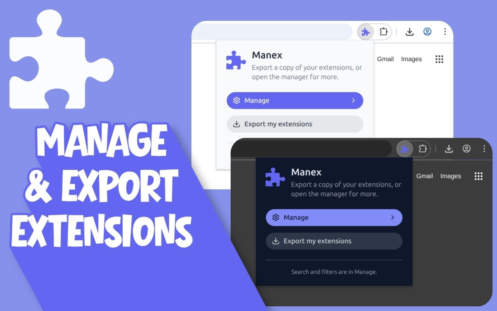

<p align="center">
  
</p>

# Manex

**Version:** `0.2.0` (authoritative field: [`package.json`](package.json) `version` — also used for the browser manifest, UI, and exported HTML).

**Manex** is a Chromium (Manifest V3) extension that helps you see every extension you have installed, save a simple list you can open in your browser, and use a dashboard for more tools as the project grows.

**Install:** [Manex — Chrome Web Store](https://chromewebstore.google.com/detail/memjkgkepkjmbehjeibgbnllkjgnejhh)

## Features

- **Toolbar popup** — open the dashboard or download your extension list as a webpage file (`manex-my-extensions-YYYY-MM-DD.html`).
- **Options page** — full-page dashboard (more UI is planned); same download action as the popup.
- **Exported list** — self-contained HTML (tables + inlined favicon); Chrome Web Store links by extension id for typical installs; no per-extension icon images in the file.
- **Theming** — follows your system light/dark preference.

## Tech stack

[WXT](https://wxt.dev) · [Vite](https://vitejs.dev) · React 19 · TypeScript · [Tailwind CSS](https://tailwindcss.com) v4 · [shadcn/ui](https://ui.shadcn.com) (Base UI + Luma) · Bun

## Prerequisites

- [Bun](https://bun.sh) (package manager and script runtime)
- Chromium-based browser (Chrome, Edge, Brave, etc.) for loading the unpacked build

## Getting started

```bash
git clone https://github.com/Wadiou/Manex.git
cd manex
bun install
bun run build
```

Then in the browser, open `chrome://extensions`, enable **Developer mode**, choose **Load unpacked**, and select **`.output/chrome-mv3/`** (the folder produced by the build).

**Use `bun run build` every time** you change code or styles, then click **Reload** on the extension card. WXT dev mode (`bun run dev`) is **not usable** with this project’s setup (popup/assets do not load correctly); treat production builds as the only way to run the extension locally.

## Scripts

| Command           | Description                                                                                                        |
| ----------------- | ------------------------------------------------------------------------------------------------------------------ |
| `bun run build`   | Generate icons, then production build to `.output/chrome-mv3/` — **use this to run the extension**                 |
| `bun run icons`   | Rasterize [`assets/logo.svg`](assets/logo.svg) into `public/icon/*.png` and sync public SVG copies                 |
| `bun run compile` | Typecheck with `tsc --noEmit`                                                                                      |
| `bun run zip`     | Build and produce a distributable zip (Chrome)                                                                     |
| `bun run dev`     | Exists for WXT tooling only; **do not** rely on it for loading the extension in the browser (broken for this repo) |

Firefox: use `bun run build:firefox` / `bun run zip:firefox` the same way (`dev:firefox` is not supported for local loading here).

## Icons

Toolbar and store icons are **PNG** files generated from the single source SVG at `assets/logo.svg`. Edit that file, then run `bun run icons` (or any command that runs it before `wxt`).

## Permissions

The extension uses the **`management`** permission to list and toggle your installed extensions. It does not declare Chrome Web Store **host** access—export only adds normal **https** links by extension id.

## License

This project is licensed under the [GNU General Public License v3.0](LICENSE) (GPL-3.0). See [`LICENSE`](LICENSE) for the full license text.

Copyright © 2026 Wadiou. You may redistribute and modify Manex under the terms of GPLv3 (see the license file for requirements when distributing binaries or conveying covered work).
